# dragon-continuous-sim

A Python simulation modeling dragon growth, energy, and population dynamics inspired by _Game of Thrones_. The project tracks age-based changes in size, metabolism, flight, and fire-breathing, while estimating environmental impacts, prey requirements, and realistic population limits across life stages.

The simulation combines lore-based descriptions with biological scaling laws to estimate growth, metabolism, population dynamics, and environmental sustainability for dragons at different life stages.

---

## Project Structure

- `LICENSE`
- `README.md`
- `data/`
- `outputs/`
- `src/`
- `requirements.txt`
- `venv/`

---

## Project Overview

The simulation models dragons’ life stages, growth, energy consumption, population dynamics, and environmental needs. Key components include:

### 1. Growth and Morphology

- Dragons are modeled through four life stages: Hatchling (0–1 yr), Young Dragon (1–4 yrs), Riding Size (4–8 yrs), and Adult (8+ yrs).
- Growth of height, length, weight, wingspan, and wing area is modeled using logistic and polynomial functions.
- Scaling relationships among morphological traits are analyzed to ensure realistic body proportions.

**Examples of morphological correlations:**

  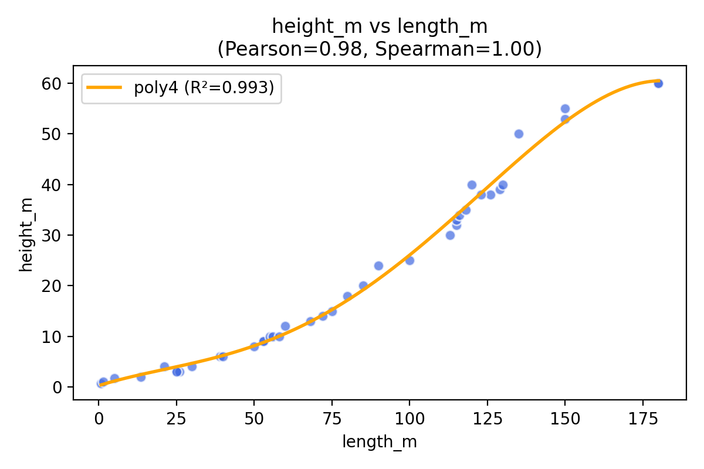
  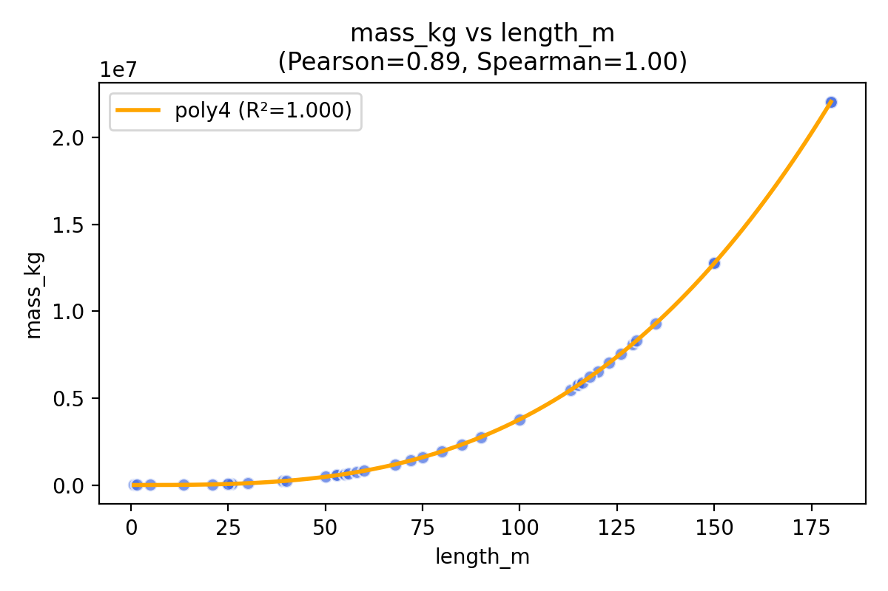

  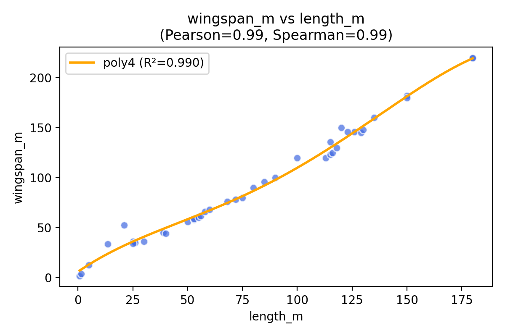
  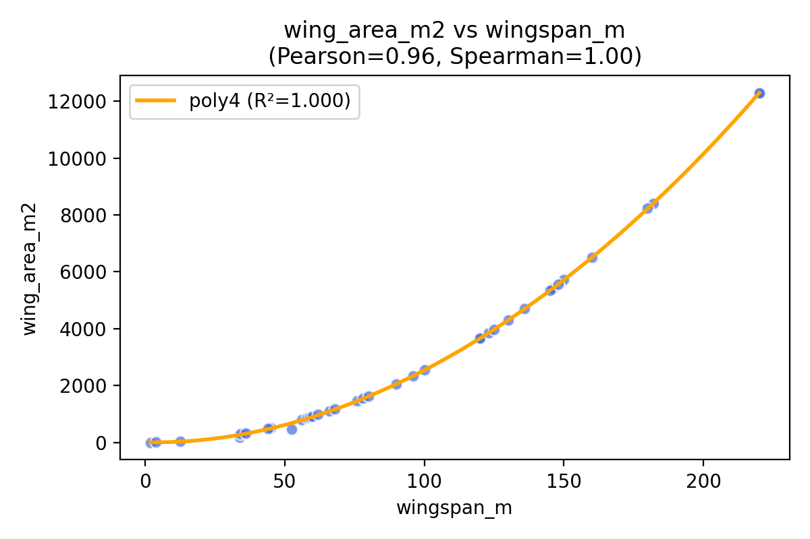

  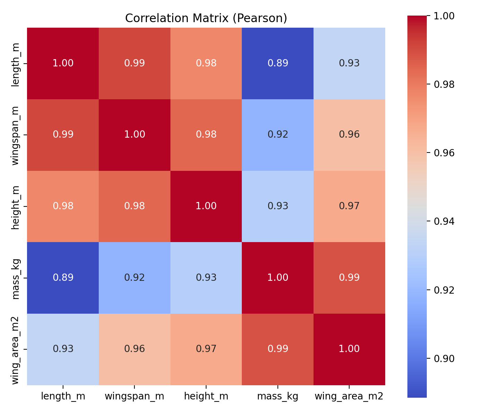

### 2. Energy and Metabolism

- Energy intake and expenditure are estimated using biological scaling and lore-based diet descriptions.
- Basal metabolic rate (BMR) is approximated using Kleiber’s law.
- Energy costs for growth, flight, hunting, and fire-breathing are included.
- Younger dragons have higher energy demands relative to their body mass, while adults store energy efficiently for large-scale activities.

**Example growth curves (mass, height, wingspan, wing area):**

  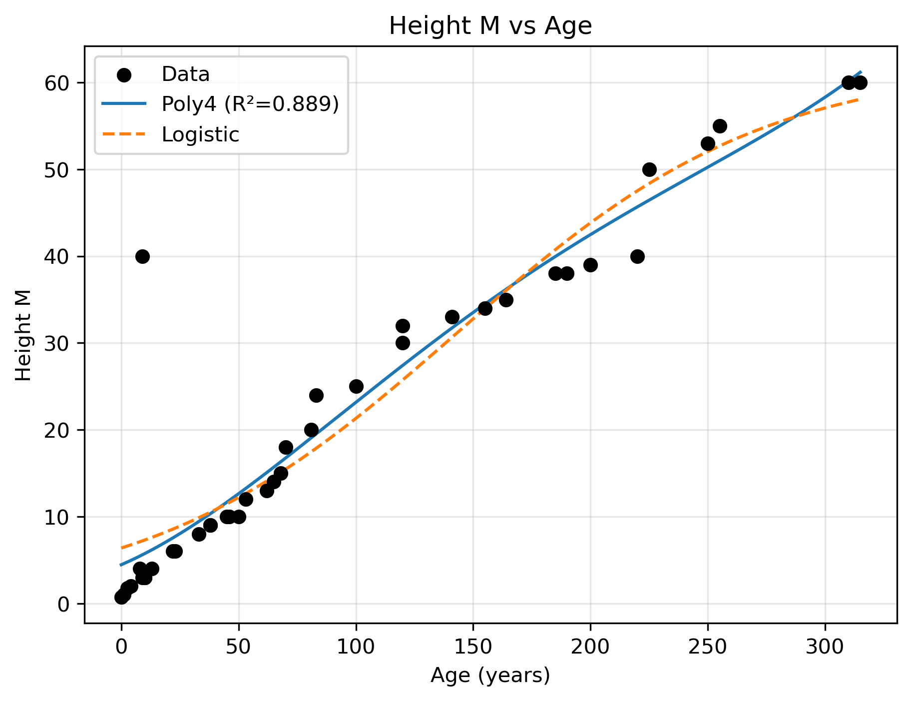
  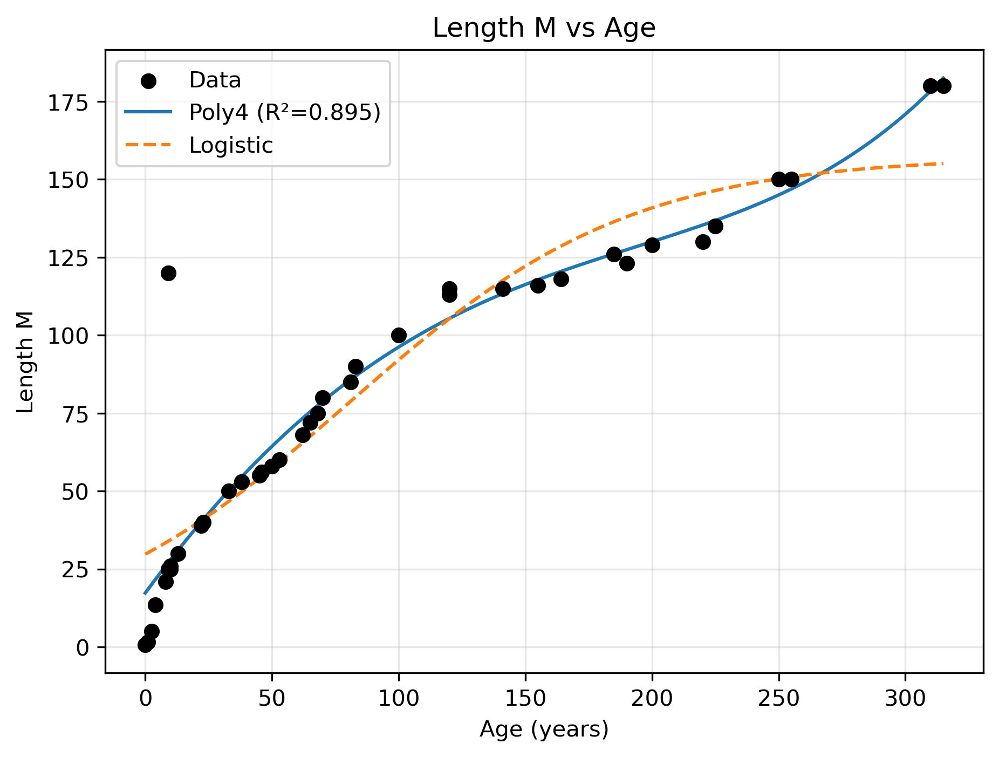
  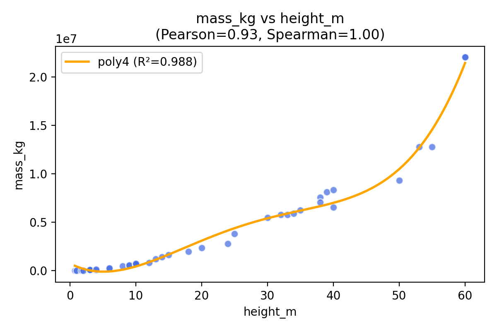

  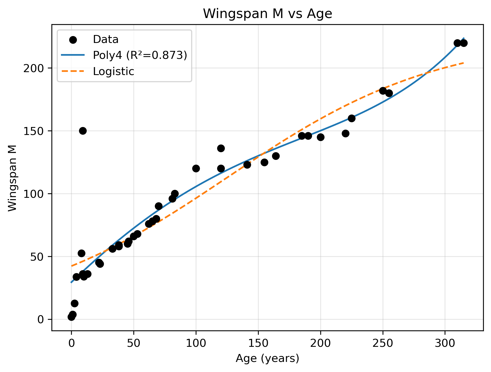
  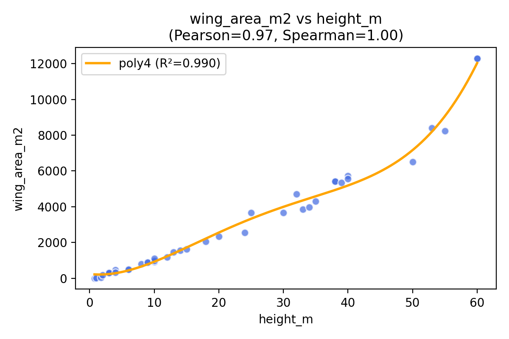

### 3. Population Dynamics

- A compartmental model tracks population changes across life stages.
- Stage-specific death rates are applied:
  - Hatchlings: ~25%
  - Young Dragons & Riding Size: ~10%
  - Adults: ~50% (primarily due to war and old age)
- Egg viability is ~20% due to the difficulty of hatching conditions.
- Birth, growth, and stage transition rates are incorporated to simulate realistic population changes in a "dragon farm" scenario.

  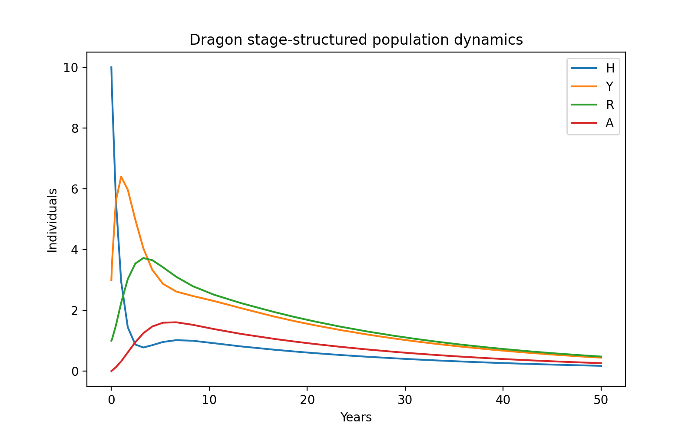

### 4. Environmental Modeling

- Land area and prey biomass required to sustain dragons are estimated based on caloric needs.
- Thermoregulatory demands are considered, reflecting dragons’ partial endothermy.
- Carrying capacity is analyzed based on terrain, prey density, and dragon size.
- Environmental limitations naturally constrain the maximum sustainable dragon population.

---

## Simulation Highlights

- Growth trajectories reflect lore-based estimates, from hatchling to full adult.
- Energy models capture stage-dependent metabolism and fire-breathing costs.
- Population models simulate survival, reproduction, and mortality under farmed conditions.
- Environmental models estimate land and prey requirements for long-term dragon sustainability.

---

## Key Findings

- Dragons grow rapidly in early life, with height, length, and weight increasing exponentially in the first few years.
- Energy demands scale with size and activity; adult dragons require massive prey intake for sustenance and fire-breathing.
- Population survival heavily depends on hatching success, early-stage mortality, and environmental capacity.
- A sustainable "dragon farm" would require extensive land and abundant prey, with careful management of mortality and reproduction.

---

## Conclusion

This project demonstrates how mathematical modeling and simulation can be applied to fantasy creatures, providing insights into growth, metabolism, population dynamics, and environmental needs. The models integrate lore-based observations with biological principles, offering a framework for studying complex ecological and energetic systems in a speculative context.

- **Growth models** capture realistic dragon development across life stages.
- **Energy models** highlight the extreme metabolic requirements of large, fire-breathing creatures.
- **Population and environmental models** illustrate the constraints of sustaining dragons over time.

---

## Keywords

dragon growth model; polynomial regression; population dynamics; energy metabolism; environmental modeling
